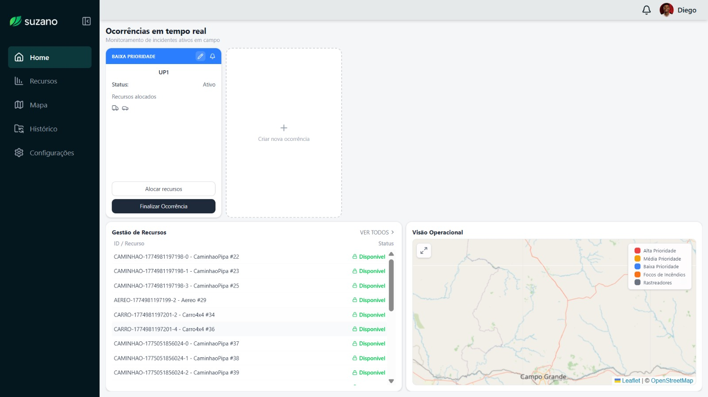
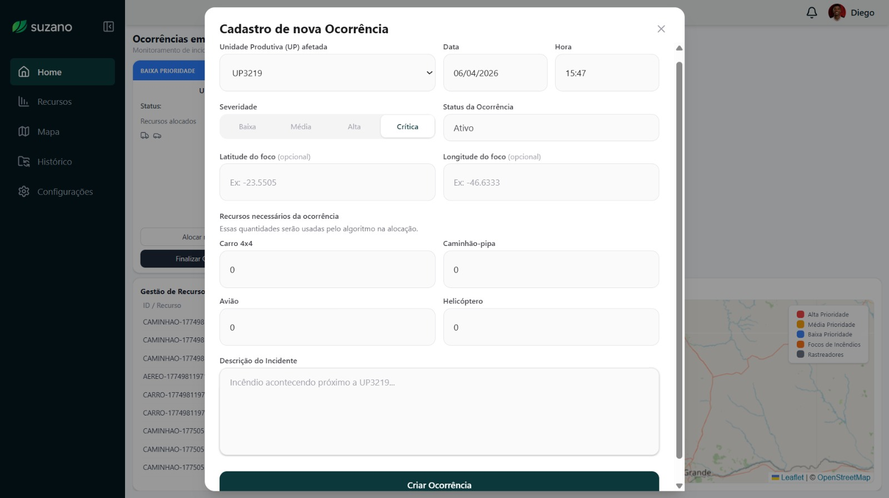

# Funil de Teste de Usabilidade

**Tarefa:** Criar ocorrências

---

## 1. Tela(s) Analisada(s)

**Telas:** Home (dashboard de ocorrências) e Modal de Cadastro de Nova Ocorrência

Figura 1 - Home – Ocorrências em tempo real

Fonte: Material produzido pelos autores (2026)

Figura 2 - Modal – Cadastro de nova Ocorrência

Fonte: Material produzido pelos autores (2026)

---

## 2. Tipo de Teste

**Tipo:** Tarefa

Será testado se o usuário consegue localizar e preencher corretamente o fluxo de criação de uma nova ocorrência, desde o acesso ao botão de criação no dashboard até a submissão do formulário com os campos obrigatórios preenchidos.

---

## 3. Conjunto de Perguntas

As perguntas seguem a lógica do funil: do geral para o específico, da compreensão inicial à ação concreta.

1. **[Abertura – contexto geral]**  
   Ao olhar para essa tela pela primeira vez, o que você entende que é possível fazer aqui?

2. **[Descoberta – localização da ação]**  
   Se você precisasse registrar um novo incidente agora, por onde começaria?

3. **[Execução – formulário]**  
   Ao preencher o formulário, quais campos você considerou obrigatórios? Teve algum que gerou dúvida sobre o que inserir?

4. **[Avaliação – feedback do sistema]**  
   Após preencher e enviar, como você sabia se a ocorrência foi criada com sucesso?

5. **[Reflexão – dificuldades]**  
   Teve algum momento em que ficou inseguro sobre o que fazer ou o que o sistema esperava de você?

---

## 4. Objetivo do Teste

Verificar se o fluxo de criação de ocorrências é claro e intuitivo para o usuário, identificando possíveis barreiras de compreensão nos campos do formulário (como latitude/longitude e alocação de recursos) e na confirmação de sucesso da ação.

---

## 5. Ação ou Entendimento Esperado

O usuário deve conseguir localizar o botão "Criar nova ocorrência", preencher os campos do modal (UP afetada, severidade, status e descrição) e submeter o formulário com confiança de que a ocorrência foi registrada corretamente no sistema.